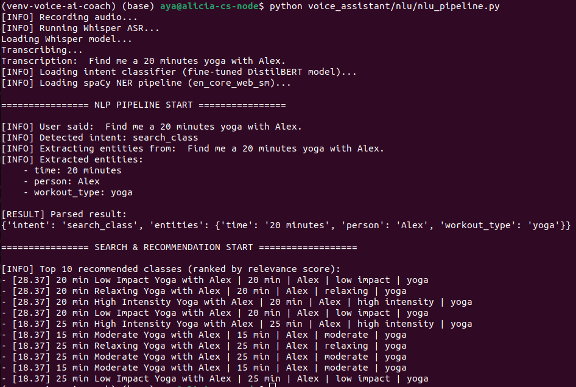

# Voice-Driven AI Workout Assistant

A fully production-ready, voice-activated assistant that transcribes spoken commands, classifies user intent, extracts workout-specific entities, and retrieves tailored workout recommendations from OpenSearch.

---

## 🚀 Features

- **🎙️ Real-Time ASR (Speech-to-Text)**  
  Transcribes live voice commands using OpenAI Whisper for fast and robust audio understanding.

- **🧠 Intent Classification (Fine-tuned DistilBERT)**  
  Intent Classification (Fine-tuned DistilBERT): Extracts user intent (e.g., search class, track progress) from spoken text using a DistilBERT model I fine-tuned on task-specific examples. Trained on custom-labeled data with GPU acceleration and hyperparameter optimization to maximize accuracy and confidence.

- **🔍 Named Entity Recognition (NER)**  
  Hybrid spaCy pipeline combining ML-based NER with custom rule-based matchers to extract structured entities like duration, intensity, instructor, workout type, and goals.

- **⚡ Semantic Search & Recommendations (OpenSearch)**  
  Vectorized search across structured workout data using boosted relevance scoring. Returns personalized workout matches based on user input semantics.

- **🧩 Modular, Extensible Architecture**  
  Clean, well-documented Python modules with separation of concerns across ASR, NLU, and search layers — ready for scaling, fine-tuning, or API integration.

---

## 🧠 Pipeline Overview

```bash
Voice Input → Whisper (ASR) → Intent Classifier → NER → OpenSearch Query → Workout Results
```

---

## 🔍 End-to-End Pipeline Demo

The following screenshot shows the full real-time pipeline in action:

1. Whisper-based voice transcription  
2. Intent detection via fine-tuned DistilBERT  
3. Entity recognition using spaCy + keyword matcher  
4. Relevance-ranked search with OpenSearch  
5. Top 10 personalized workout recommendations  




## 🔧 Technologies & Tools

- **Python 3.11**
- **PyTorch / HuggingFace Transformers** (intent classification)
- **spaCy** (NER with custom patterns)
- **OpenAI Whisper** (ASR)
- **OpenSearch** (indexed retrieval)
- **Docker + Docker Compose** (local OpenSearch cluster)
- **MLflow** *(optional)*: for model tracking
- **Airflow** *(optional)*: for orchestration

---

## 📁 Project Structure

```bash
voice_assistant/
├── asr/                  # Whisper-based ASR
│   └── transcribe.py     # Transcribes audio into text
│   └── record_and_transcribe.py     # Records audio and transcribes
├── data/                 # Input audio + training CSVs
├── models/               # Fine-tuned intent classifier
├── nlu/                  # Intent & entity extraction logic
│   ├── custom_entity_extractor.py
│   ├── train_intent_classifier.py
│   └── nlu_pipeline.py   # End-to-end NLP pipeline
├── search/               # OpenSearch indexing + query
├── utils/                # Configs and shared helpers
└── app.py                # (Optional) CLI or UI runner
```

---

## 📦 Installation

```bash
git clone https://github.com/aya0221/voice-ai-workout-assistant.git
cd voice-ai-workout-assistant
python -m venv venv-voice-ai-coach
source venv-voice-ai-coach/bin/activate
pip install -r requirements.txt
```

---

## 🗣️ Run the Assistant (End-to-End)

```bash
# Run the full voice-driven NLP pipeline:
python voice_assistant/nlu/nlu_pipeline.py
```

This will:

- Record 5 seconds of speech via microphone
- Transcribe the `.wav` using Whisper ASR
- Classify the intent (fine-tuned DistilBERT)
- Extract structured entities (via spaCy + rule-based matcher)
- Query OpenSearch index and return top matching workouts

---

## 📊 Intent Classes

- `search_class`
- `track_metric`
- `greeting`

All fine-tuned from `distilbert-base-uncased` on 1000+ balanced training examples.

---

## 🧠 Entity Types Extracted

| Entity       | Example                |
|--------------|-------------------------|
| `time`       | "30 minute"            |
| `intensity`  | "low impact"          |
| `person`     | "Robin"               |
| `goal`       | "lose weight"         |
| `type`       | "cycling", "yoga"    |
| `tag`        | "endurance", "mood"  |

---

## 🧪 Model Training

Run intent classifier fine-tuning:
```bash
python voice_assistant/nlu/train_intent_classifier.py
```

MLflow or custom logs can be integrated for reproducibility.

---

## 🔎 Indexing Workouts (OpenSearch)

```bash
# Start OpenSearch cluster
sudo docker-compose up -d

# Index data
python voice_assistant/search/index_workouts.py
```

---

## 🧼 Best Practices

- ✅ Modular, reusable components
- ✅ Clear logging for demo/debug
- ✅ Scalable for future domain extensions
- ✅ Easy to plug into any UI/frontend

---

## 🧠 Future Work

- 🎙️ Frontend voice interface (Streamlit or React)
- 🤖 Chatbot-style follow-up for clarification
- 🌍 Deployment on HuggingFace Spaces or local Docker API
- 📈 MLflow integration for training runs
- ⏰ Airflow DAG for pipeline automation


---
## 🔊 Test Only ASR (Speech → Text)

```bash
# Record a 5-second voice command
ffmpeg -f alsa -i default -t 5 voice_assistant/data/input.wav

# Run ASR transcription only
python voice_assistant/asr/transcribe.py --file voice_assistant/data/input.wav
```

**Expected Output:**

```
Loading Whisper model...
Transcribing...
Transcription: find me a 30 minute ride with Cody
```

--- 

## 📬 Contact
For technical questions, feel free to reach out via the repo's issues tab or email (ayaoshima.us@gmail.com).