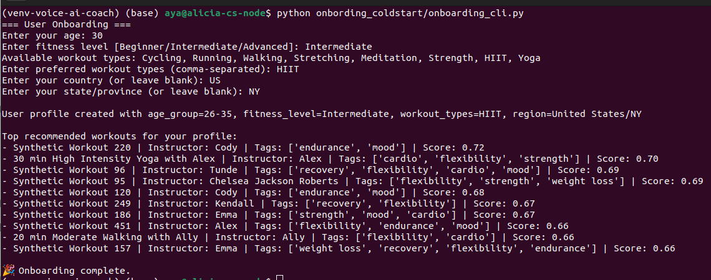

# Personalization Engine: Cold-Start Recommendation System

This module implements a **cold-start recommendation pipeline** for first-time users of a workout recommendation platform. It simulates an industry-grade recommendation system that precomputes segment-personalized workout lists and serves them at runtime based on onboarding input — without needing user history.

---

## Purpose

When a user signs up for the first time, the system cannot rely on behavioral history. This **cold-start module** computes and stores **segment-based recommendations** by leveraging:

* User-provided demographic and preference inputs
* Offline engagement data from similar users
* Heuristic or Bayesian scoring for ranking
* Optional freshness and diversity heuristics

---

## Components

### - `rec_engine.py` (Core Recommendation Logic)

**Type:** Real-time hybrid engine
**Backend:** MySQL, OpenSearch
**Usage:** Fetches top-k personalized workouts based on:

* Profile segmentation (age × level × type)
* Optional keyword queries
* Feedback history, OpenSearch ranking, or fallback

### - `onboarding_coldstart/onboarding_cli.py`

**Type:** CLI demo
**Usage:** Accepts new user inputs, simulates onboarding, retrieves cold-start recommendations from:

* `voice_assistant/data/user_database/segment_recommendations.csv`
* `voice_assistant/data/database_workouts/augmented_workouts.json`

---

## Technical Pipeline

### 1. Segment Formation

I built user segments via:

```math
\text{Segment Key} = \text{Age Group} \times \text{Fitness Level} \times \text{Workout Type}
```

Example: `"18-25|Beginner|Yoga"`

This creates a fine-grained segment space for high-resolution personalization.

---

### 2. Engagement Scoring (Offline)

For each segment-workout pair, engagement is computed using:

```math
\text{Score} = \alpha \cdot \text{completion\_rate} + \beta \cdot \text{like\_rate} + \gamma \cdot \text{views\_norm}
```

* `completion_rate = #completed / #started`
* `like_rate = #likes / #views`
* `views_norm` is z-normalized across the corpus

**Tunable weights**: `α, β, γ` allow business-driven calibration (e.g., prioritize likes over views).

---

### 3. Bayesian Smoothing (Beta-Binomial smoothing)

To stabilize engagement metrics under sparse data:

```math
\hat{r} = \frac{s + \alpha_0}{n + \alpha_0 + \beta_0}
```

* `s`: observed successes (e.g., likes)
* `n`: trials (e.g., views)
* `α₀, β₀`: prior hyperparameters (e.g., Beta(2, 5))

This reduces volatility in early-stage or low-traffic segments.

---

### 4. Freshness Boost (Ranking)

To favor recent workouts:

```math
\text{Score}_{fresh} = \text{Score} \cdot e^{- \lambda \cdot \text{days\_old}}
```

This exponential decay ensures users receive up-to-date content.

---

### 5. Diversity Reranking (MMR - Maximal Marginal Relevance)

Reordered top-K using tag similarity and diversity penalty → ensures variety; avoids repetitive or similar workouts

---

## Runtime Logic: How It Works

### Onboarding Demo (`onboarding_cli.py`)

When the CLI script runs:

1. Accepts user inputs for:

   * Age (mapped to age group)
   * Fitness level
   * Preferred workout types
   * Region (country/state)
2. Constructs segment keys like `26-35|Advanced|Cycling`
3. Looks up those keys in:

   * `segment_recommendations.csv` → Precomputed ranked workout IDs
   * Joins with `augmented_workouts.json` to display metadata
4. Returns top-10 segment-matched workouts:

   * Title, instructor, tags, engagement score


No model training, database, or OpenSearch needed — pure lookup from precomputed results.
---

### Real-Time Recommendations (`rec_engine.py`)

Used in production pipeline with database + OpenSearch:

* If user has no history:

  * Lookup top workouts from `cold_start_top_workouts` SQL table using segment keys
  * Applies fallback logic if preferred workout type is missing
* If user has history:

  * Personalizes based on past feedback (e.g., liked instructors)
  * Uses OpenSearch query for keyword-driven retrieval
  * Filters flagged/disliked instructors
  * Avoids duplicate seen workouts

**OpenSearch Query** includes:

* Must: keyword match (title, tags, description)
* Filter: fitness level, duration, type
* Should: preference boosting (types, liked instructors)
* Must-not: flagged or disliked instructors

---

---
## Data

### `sessions.csv`

Logs each user's workout attempt. Used for history, instructor tracking, abandonment, and feedback joining.

```csv
session_id,user_id,workout_id,workout_type,instructor_id,started_at,completed_at
s001,u001,w123,Yoga,i10,2025-05-10 09:00:00,2025-05-10 09:30:00
s002,u002,w456,Cycling,i20,2025-05-11 14:00:00,
s003,u001,w789,Strength,i10,2025-05-12 18:00:00,2025-05-12 18:45:00
```

* `completed_at` is `NULL` if user abandoned (used to compute instructor flagging rate)

---

### `augmented_workouts.json`

Metadata for workouts. Used to display titles/tags and by OpenSearch index.

```json
[
  {
    "workout_id": "w123",
    "title": "30-Minute Gentle Yoga Flow",
    "instructor": "Alex Morgan",
    "instructor_id": "i10",
    "workout_type": "Yoga",
    "fitness_level": "Beginner",
    "duration": 30,
    "tags": ["calm", "stretch", "low-impact"]
  },
  {
    "workout_id": "w456",
    "title": "20-Minute HIIT Burner",
    "instructor": "Jamie Lee",
    "instructor_id": "i20",
    "workout_type": "HIIT",
    "fitness_level": "Intermediate",
    "duration": 20,
    "tags": ["intense", "cardio", "burn"]
  }
]
```

---

### SQL Schema Reference (MySQL)

| Table                     | Purpose                               |
| ------------------------- | ------------------------------------- |
| `users`                   | Stores user profiles after onboarding |
| `sessions`                | Logs workout session start/completion |
| `feedback`                | Stores thumbs up/down feedback        |
| `cold_start_top_workouts` | Precomputed segment rankings          |
| `flags`                   | Stores instructor-level quality flags |
```


### Key Takeaways

* **Cold-start problem** is solved via **precomputed segment matching**
* **No runtime model needed** for first-time recommendations
* System supports **scaling** to millions of users with minimal latency
* Allows seamless integration with **OpenSearch**, **MySQL**, or **static files**
* Modular enough to support evolution to **hybrid or neural models** later

